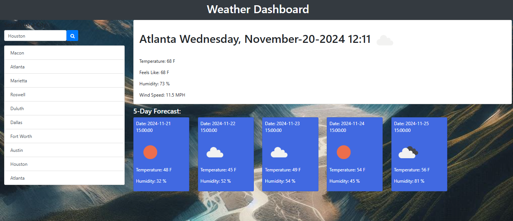

# Weather-App-KH


## Description

```
This is an application where the user enters the city of their choice to view the weather.  The application should show the current temerature, humidity, and wind speed. Additionally, the page should also show a five day forecast below showing similar inforamtion.

If the user decides to search for another city, they can type in the new city and it current weather and 5 day forecast will populate the page.

```




## Technologies

```
!!Currently integrating with AWS!!

Front-End: Server-side APIs, JavaScript, HTML, and CSS
```

## Link

!!Currently integrating with AWS!!

Here is the deployed link for Github Pages for now: https://hallkr86.github.io/weather-app-kh/

## Questions or Suggestions

Any questions can be sent to me via Gmail at: hallkr86@gmail.com

## License
```

Copyright 2024 - Kesha Hall

Permission is hereby granted, free of charge, to any person obtaining a copy of this software and associated documentation files (the "Software"), to deal in the Software without restriction, including without limitation the rights to use, copy, modify, merge, publish, distribute, sublicense, and/or sell copies of the Software, and to permit persons to whom the Software is furnished to do so, subject to the following conditions:

The above copyright notice and this permission notice shall be included in all copies or substantial portions of the Software.

THE SOFTWARE IS PROVIDED "AS IS", WITHOUT WARRANTY OF ANY KIND, EXPRESS OR IMPLIED, INCLUDING BUT NOT LIMITED TO THE WARRANTIES OF MERCHANTABILITY, FITNESS FOR A PARTICULAR PURPOSE AND NONINFRINGEMENT. IN NO EVENT SHALL THE AUTHORS OR COPYRIGHT HOLDERS BE LIABLE FOR ANY CLAIM, DAMAGES OR OTHER LIABILITY, WHETHER IN AN ACTION OF CONTRACT, TORT OR OTHERWISE, ARISING FROM, OUT OF OR IN CONNECTION WITH THE SOFTWARE OR THE USE OR OTHER DEALINGS IN THE SOFTWARE.
```